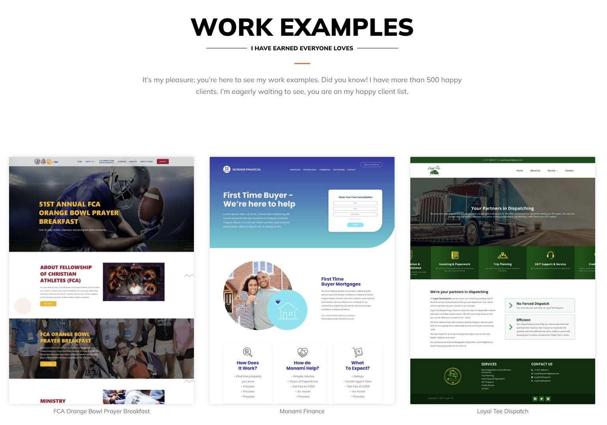

### Hi All 👋

I’m Sandipan Das, 
<strong> Full Stack Web Developer</strong> (React, Laravel, WordPress, CodeIgniter, and UI/UX) 

Programming is my passion and profession. 

Last few years, I have completed hundreds of web projects using various platforms. 

 <strong>I’m very passionate about sharing my expertise globally and help out others.</strong>  

<h2><strong>Language and Tech Stack</strong></h2>
<table>
    <td>  </td>
    <td>  </td>
    <td>  </td>
    <td>  </td>
    <td>  </td>
    <td>  </td>
    <td>  </td>
</table>
<h2><strong>Tools and Technology</strong></h2>
<table>
    <td>  </td>
    <td>  </td>
    <td>  </td>
    <td>  </td>
    <td>  </td>
    <td>  </td>
</table>
<h2><strong>Check work Examples</strong></h2>

<h2><strong> <a href="https://sandipandas.net">See More Work Examples</a> </strong></h2>

<h2><strong>📫 How to reach me: ...</strong></h2>
<table>
    <td></td>
    <td></td>
    <td></td>
    <td></td>
    <td></td>
    <td></td>
    <td></td>
    <td></td>
</table>
Let's schedule a meeting by  <a href="https://calendly.com/sandipandas/15min">calendly Click Here </a>

<!--
**sandidas/sandidas** is a ✨ _special_ ✨ repository because its `README.md` (this file) appears on your GitHub profile.

Here are some ideas to get you started:

- 🔭 I’m currently working on ...
- 🌱 I’m currently learning ...
- 👯 I’m looking to collaborate on ...
- 🤔 I’m looking for help with ...
- 💬 Ask me about ...
- 📫 How to reach me: ...
- 😄 Pronouns: ...
- ⚡ Fun fact: ...
-->
